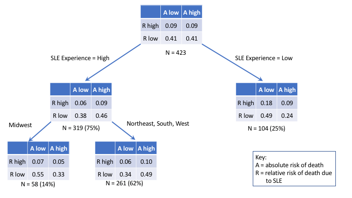

```{r, echo=F}
knitr::opts_chunk$set(echo=FALSE)
```

```{r, echo=FALSE, results='hide', message=FALSE, warning=FALSE}
source('lib/reload.R'); reload()
load(file.path(datadir, 'data','rda','data.rda'))
```

# Methods

We are interested in discovering if the death risk in individuals admitted with sepsis differs between SLE and non-SLE patients within hospitals. In other words, do SLE patients admitted with sepsis experience excess deaths compared to non-SLE patients, within hospitals. 

We take a counterfactual approach to this problem. We propose to model the risk of death among the non-SLE patients conditional on various covariates including the admission hospital, age, comorbidities, admission on ventilator, gender, and type of insurance. We would then use this model to predict the risk (or probability) of death during hospitalization for each SLE patient using the observed covariates for that patient. This would give the risk of death for that patient under the assumption that they had the same conditional death risk as non-SLE patients. If we add up these predicted probabilities over patients in a hospital, we would get the _expected_ number of deaths (E) among SLE patients under the assumption that they shared the same experience as non-SLE patients. We would compare this with the _observed_ number of deaths (O) among SLE patients at that hospital. The O/E ratio is akin to a standardized mortality rate, where the standardized population would be non-SLE patients with sepsis in the sample. 

In order to flexibly model the conditional risk of death, we use the XGBoost algorithm [^1]. This modern form of gradient boosted trees allows for regularization as well as stochastic
gradient descent methods to reduce the chance of overfitting, and utilizes decision trees as the 
learning engine to allow flexible prediction of the outome from heterogeneous responses. For training
the XGBoost model,we use the R package xgboost [^2], running on R[^3] version 3.4. We 
train this model on the non-SLE patients,  using 5-fold cross-validation to train the 
model parameters (using the R package caret[^4]). Our optimal trained model achieved a cross-validated average AUC of 0.86. We then use this trained model to predict the risk of death among SLE patients,
by scoring each patient using the model to get a predicted probability of death. Within hospital, 
we then add these predicted probabilities to obtain the expected number of deaths under the assumption
that the risk for SLE and non-SLE patients are the same. Finally, we compare the observed 
number of deaths per hospital with the expected number of deaths under the model. Note that the
expected conditional probabilities of death use information across all hospitals and patients through the XGBoost model. Also note that, despite the hospitals being sampled from the national 
population of hospitals under the NIS, our analysis is conditional on the hospitals and patients
in our dataset and so we do not use the sampling weights provided by NIS in our modeling. 

All analyses were performed using R version 3.4 along with the packages xgboost, 
caret and survey[^5].

[^1]: Chen, T., & Guestrin, C. (2016, August). Xgboost: A scalable tree boosting system. In Proceedings of the 22nd acm sigkdd international conference on knowledge discovery and data mining (pp. 785-794). ACM.
[^2]:Tianqi Chen, Tong He, Michael Benesty, Vadim Khotilovich and Yuan
  Tang (2017). xgboost: Extreme Gradient Boosting. R package version
  0.6-4. https://CRAN.R-project.org/package=xgboost
[^3]: R Core Team (2017). R: A language and environment for statistical
  computing. R Foundation for Statistical Computing, Vienna, Austria.
  URL https://www.R-project.org/.
[^4]: Max Kuhn. Contributions from Jed Wing, Steve Weston, Andre
  Williams, Chris Keefer, Allan Engelhardt, Tony Cooper, Zachary
  Mayer, Brenton Kenkel, the R Core Team, Michael Benesty, Reynald
  Lescarbeau, Andrew Ziem, Luca Scrucca, Yuan Tang, Can Candan and
  Tyler Hunt. (2017). caret: Classification and Regression Training.
  R package version 6.0-77. https://CRAN.R-project.org/package=caret
[^5]: T. Lumley (2017) "survey: analysis of complex survey samples". R
  package version 3.32.

# Results

Table 1 gives the sampling weight adjusted summary statistics for various measurements
utilized in our analysis, stratified by SLE status and vital status. We see that the SLE patients were over 85% female, whereas roughly half of the 
non-SLE patients were female. We also see that more than two-thirds of those who died were put on
a ventilator on admission, compared to less than one-sixth among those who lived. There were no real
differences in insurance coverage across the groups. We note that for a hospital to be 
eligible for this study, it had to have admitted _at least 5 SLE patients with sepsis_ over
the scope of the survey data (2003-2012 and hospital selected in NIS sample). 
```{r, results='asis', fig.cap='Table 1: Summaries of differnet patient characteristics by vital staus and SLE status'}
out <- all_data %>% group_by(dead, lupus) %>% 
  summarize(Age = round(mean(age), 2),
            Female = paste(round(mean(male=='0')*100,2),'%'),
            `Elix score` = round(mean(elix_score,na.rm=T), 2),
            `On ventilator` = paste(round(100*mean(ventilator=='1'), 2),'%'),
            `On medicare` = paste(round(100*mean(medicare), 2),'%'),
            `On medicaid` = paste(round(100*mean(medicaid),2),'%'),
            `On private insurance` = paste(round(100*mean(private),2),'%'), 
            `On other insurance` = paste(round(100*mean(otherins),2),'%')) %>% 
  ungroup() %>% 
  mutate(dead = ifelse(dead == 1, 'dead', 'alive'),
         lupus = ifelse(lupus == 1, 'sle','non-sle'),
         cats = paste(lupus, dead)) %>% 
  select(-dead, -lupus) %>% select( cats, Age:`On other insurance`)
out2 = data.frame(t(out)[-1,])
names(out2) <- unique(out$cats)
knitr::kable(out2)
```

We next look at the distribution of the observed/expected ratio of deaths by hospital derived
using our machine learning scheme. We find that 163 hospitals did not see any sepsis-related deaths 
among SLE patients, and so have an O/E ratio of 0. Among the rest of the 423 hospitals, we see
that the O/E ratio could be as high as 10.48, with the median value being 1.47, and the 3rd quartile
being 2.04. 

```{r, fig.width=7, fig.cap='Figure 1: Distribution of observed/expected ratio for deaths from sepsis across 423 hospitals selected from NIS who admitted at least 5 SLE patients with sepsis within the scope of this study'}
load('data/lupuseffect.rda')
blah = oe_overall %>% filter(oe_ratio>0)
bl2 = oe_overall %>% filter(oe_ratio==0)

blah <- rbind(blah, bl2[1:45,])
plt <- ggplot(blah, aes(oe_ratio))+
  geom_histogram(binwidth=0.25)+
  scale_x_continuous('Observed/Expected ratio',breaks=seq(0,10))+
  geom_vline(xintercept=1, linetype=2)+
  ylim(0,50)+
  annotate('text',x=0, y=47,label=sprintf('\u2191'))+
  annotate('text',x=0, y=49, label='N=163', size=3) + 
  ylab('Frequency')
print(plt)
death_rate <- all_data %>% group_by(hospid) %>% summarize(rate = mean(dead))
```

The O/E ratio gives the conditional relative risk of death from sepsis by SLE status. However,
it is entirely feasible that one could have a hospital with a high death rate from sepsis, but a low
relative risk from SLE, and vice versa. Figure 2 investigate the comparative effects of the relative risk of
death from SLE and the absolute risk of death from sepsis by hospital. Here "A" refers to the 
absolute risk of death by hospital (i.e. the probability of death from sepsis that is observed), and 
"R" refers to the relative risk of death from sepsis due to SLE status. The cutoff for denoting low and high relative risks was set at 2, i.e., more than a 2-fold increased risk of death due to sepsis
was considered high. The cutoff for the absolute death rate from sepsis being called high is the median value of `r paste0(format(100*median(death_rate$rate), digits=2, nsmall=2),'%')`. We see that even though the vast majority of hospitals in this study have a reasonable death rate from sepsis, there are some hospitals whith very high death rates where there is no effect of SLE, some hospitals with high absolute death rates where the rates for SLE patients are even higher, and some hospitals where the absolute death rate is low, but the SLE patients have a much higher (4-6, upto 10 times higher) death rate. 

```{r, message=F, warning=F, results='hide', fig.width=7, fig.cap="Figure 2: Relation between the hospital death rate for lupus and the relative risk of death by SLE status by hospital. Circle sizes are proportional to the number of SLE patients with sepsis seen at the hospital over the study period. "}
death_rate <- all_data %>% group_by(hospid) %>% summarize(rate = mean(dead))
lupus <- all_data %>% group_by(hospid) %>% summarise(n_lupus = sum(lupus))
hosp_data <- hosp_data %>% left_join(death_rate) %>% left_join(lupus) %>% left_join(oe_overall)
dat_for_plot <- hosp_data %>% select(hospid, rate, n_lupus, oe_ratio) 
mr <- median(dat_for_plot$rate)
plt <- ggplot(dat_for_plot, aes(rate, oe_ratio))+
  # geom_hline(yintercept = c(1,2), linetype=c(1,2), size=2, alpha = c(0.5,1)) +
  geom_segment(aes(x = median(rate), xend = median(rate), y=0, yend=8),
               linetype=2)+
  geom_segment(x = 0, xend=.38, y=1,yend=1,
               linetype=1, size=1, color='grey')+
  geom_segment(x = 0, xend=.38, y=2,yend=2,
               linetype=2, size=1.5, alpha=1)+
  geom_point(aes(size=n_lupus)) +
  scale_x_continuous('Death rate', 
                     breaks = c(.1, .2, .3),
                     labels = c('10%','20%','30%')) + 
  scale_y_continuous('O/E ratio for lupus', breaks = c(1,seq(0,10,by  =2))) + 
  scale_size_continuous('# SLE', breaks =c(10,20,40,60))+
  annotate('text',x = c(mr-0.03, mr+0.03, mr), 
                      y = c(9,9,8.3),
           label=c(paste('\u2190','A low'),
                   paste('A high','\u2192'),'Median'), 
           hjust=c(1,0,0), angle=c(0,0,90), size=5)+
  annotate('text', 
           x = c(.4,.4),
           y = c(1.5,2.5),
           label = c(paste('R low',sprintf('\u2192')), paste(sprintf('\u2190'),'R high')),
           angle=-90, vjust = c(.5,.5), hjust=c(0,1), size=5)
ggsave('Fig2.tiff', width=8, height=4, units='in')
print(plt)
```


The classification of hospitals into R low/high and A low/high is then used to see what kinds of 
hospital-level characteristics might be predictive of this joint status. We look at this by fitting
a multiclass decision tree using the CART methodology[^6], as implemented in the R package rpart[^7]. Figure 3 shows the fit decision tree, where the table each node gives the relative frequency of each of the 4 categories of hospitals at that node. We find that SLE experience, i.e. the number of SLE patients seen at the hospital, and region segregate the classes of hospitals best. Hospitals with low SLE experience and low absolute death rates have a 3-fold higher chance of being classified (R high, A low) than hospitals with high SLE volume. Among high SLE experience hospitals, Midwest hospitals are 
less likely to have a high relative risk due to SLE than the other regions. 

```{r, echo=F, fig.cap = 'Decision tree of hospital status based on absolute and relative risks of death, with hospital characteristics like SLE experience, location, bed size and whether it was a rural or urban hopsital being predictors'}

```


[^6]: Breiman, L., Friedman, J., Stone, C. J., & Olshen, R. A. (1984). Classification and regression trees. CRC press.
[^7]: Terry Therneau, Beth Atkinson and Brian Ripley (2017). rpart:
  Recursive Partitioning and Regression Trees. R package version
  4.1-11. https://CRAN.R-project.org/package=rpart
